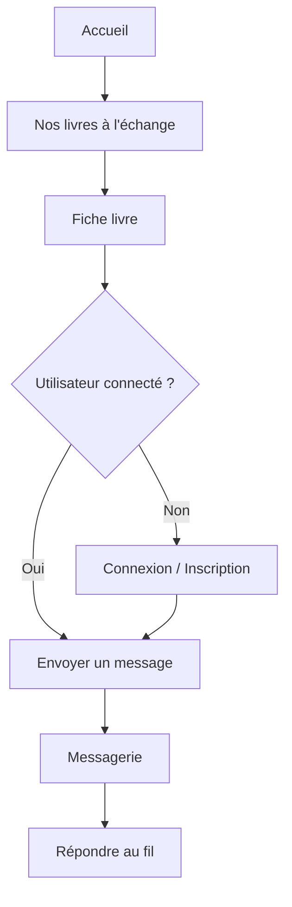
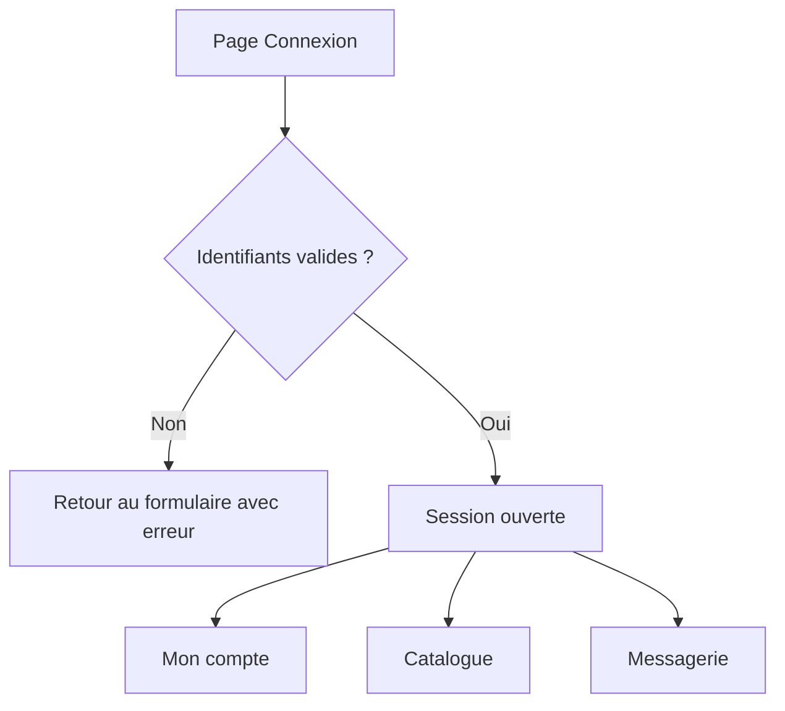
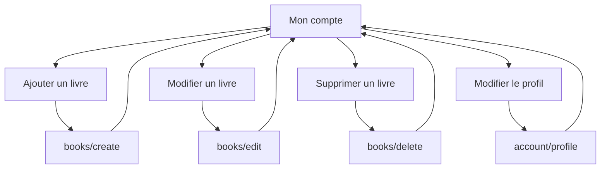
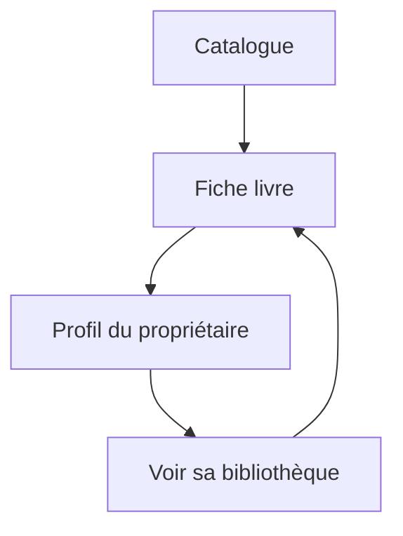
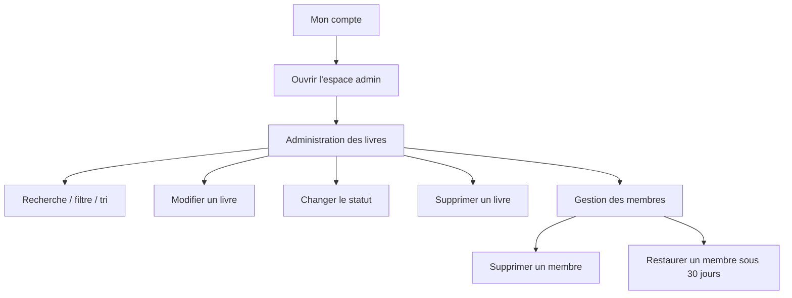
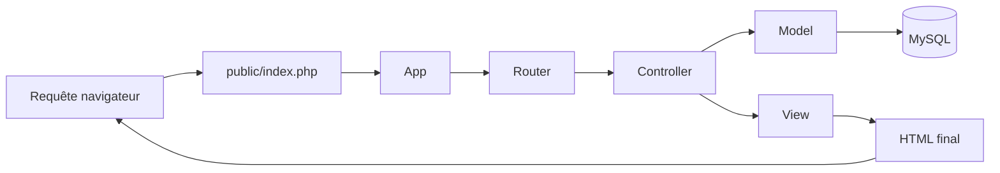

# Schéma Des Flux Du Site

Ce document montre simplement comment les principales pages du site s'enchaînent.

## Parcours utilisateur principal



## Flux d'authentification



## Flux livre côté membre



## Flux messagerie

```mermaid
flowchart TD
    A[Fiche livre] --> B[Bouton Envoyer un message]
    B --> C[/messages/thread?user=...&book=...]
    C --> D[Fil de discussion]
    D --> E{Fil disponible ?}
    E -- Oui --> F[Réponse autorisée]
    E -- Non --> G[Retour vers la messagerie]
    F --> H[Message envoyé]
    H --> D
```

## Flux profil public



## Flux administration



## Flux technique simplifié MVC



## Pages principales concernées

- Accueil : [home/index.php](/opt/lampp/htdocs/tomtroc/app/Views/home/index.php)
- Catalogue : [books/exchange.php](/opt/lampp/htdocs/tomtroc/app/Views/books/exchange.php)
- Fiche livre : [books/show.php](/opt/lampp/htdocs/tomtroc/app/Views/books/show.php)
- Messagerie : [messages/inbox.php](/opt/lampp/htdocs/tomtroc/app/Views/messages/inbox.php)
- Mon compte : [account/index.php](/opt/lampp/htdocs/tomtroc/app/Views/account/index.php)
- Gestion du profil : [account/profile_edit.php](/opt/lampp/htdocs/tomtroc/app/Views/account/profile_edit.php)
- Admin livres : [admin/books.php](/opt/lampp/htdocs/tomtroc/app/Views/admin/books.php)
- Admin membres : [admin/members.php](/opt/lampp/htdocs/tomtroc/app/Views/admin/members.php)
