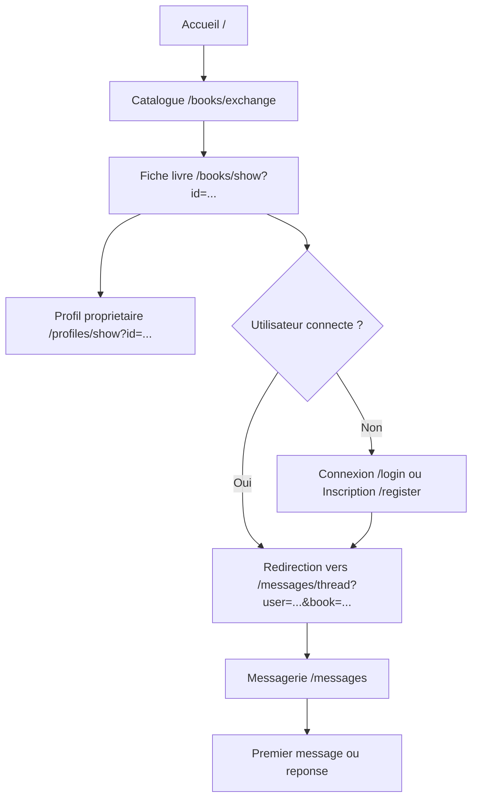
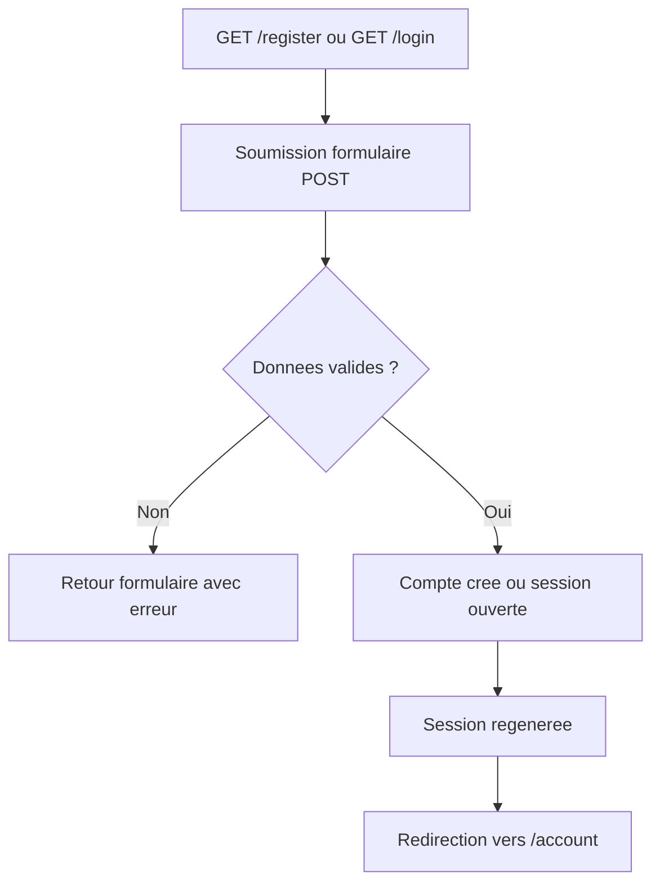
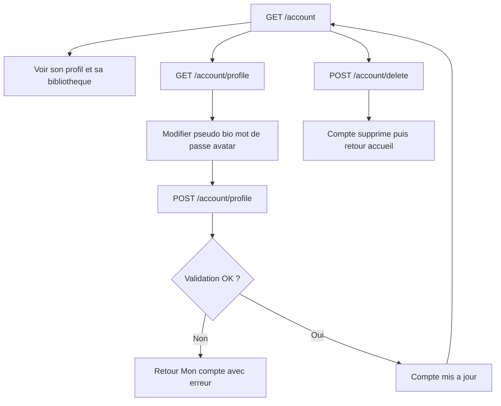
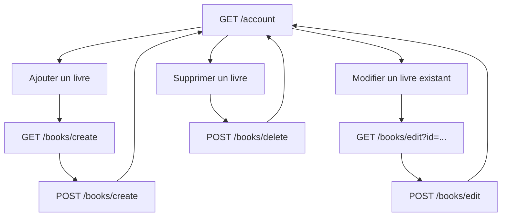
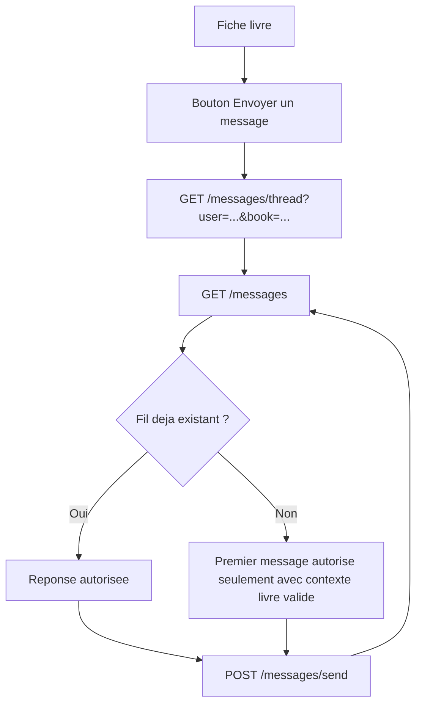
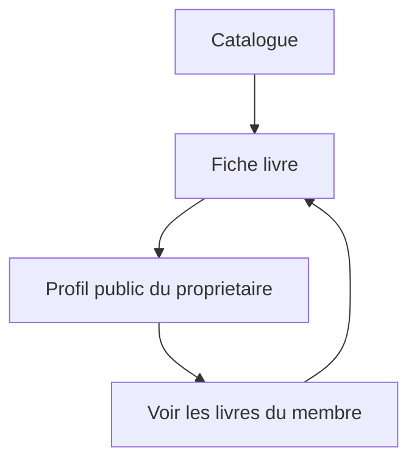
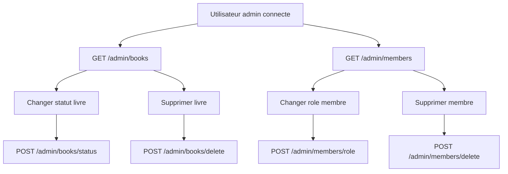
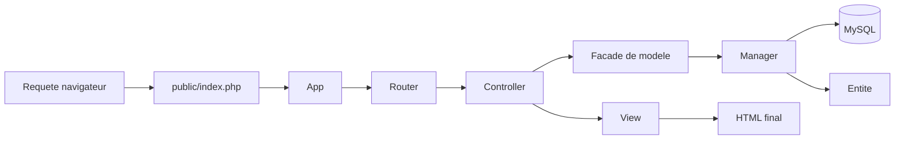

# Schema Des Flux Du Site

Ce document decrit les parcours reels du projet TomTroc a partir des routes et des controleurs actuellement en place.

## Parcours utilisateur principal

## Flux d'authentification

## Flux compte membre

## Flux livre cote membre

## Flux messagerie

## Flux profil public

## Flux administration

## Flux technique simplifie MVC

## Pages et routes principales

- Accueil : `/`
- Inscription : `/register`
- Connexion : `/login`
- Catalogue : `/books/exchange`
- Fiche livre : `/books/show?id=...`
- Profil public : `/profiles/show?id=...`
- Mon compte : `/account`
- Edition profil : `/account/profile`
- Messagerie : `/messages`
- Redirection vers un fil : `/messages/thread?user=...&book=...`
- Administration livres : `/admin/books`
- Administration membres : `/admin/members`

## Points importants a dire a l'oral

- Le premier message vers un membre passe par un livre valide ou un fil deja existant.
- Les actions sensibles sont en `POST` avec protection CSRF.
- Les zones membre et admin sont protegees par controle d'acces.
- Le flux technique ne passe plus seulement par un `Model` generique : il inclut maintenant des entites et des managers.
